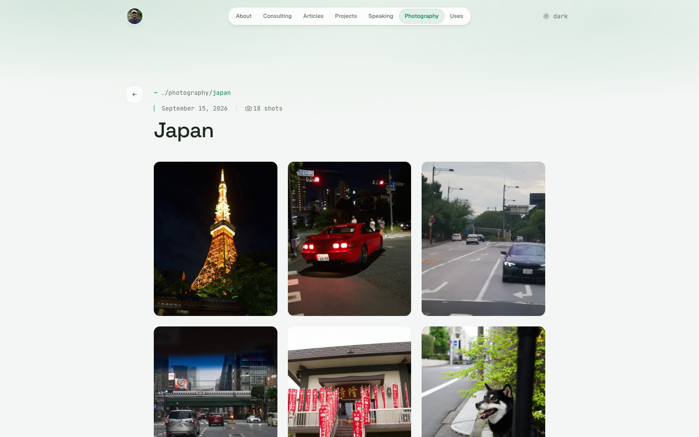
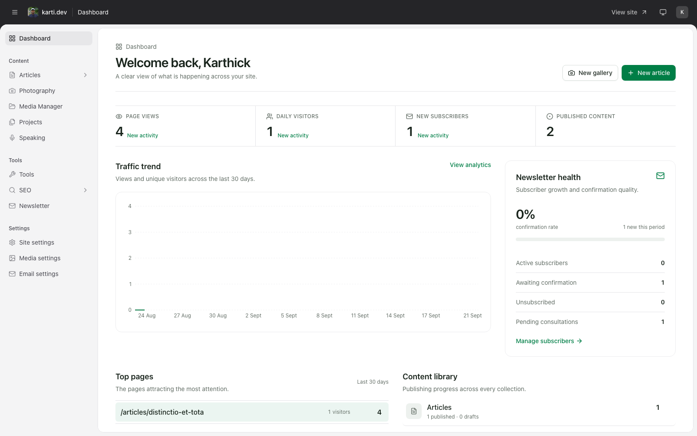
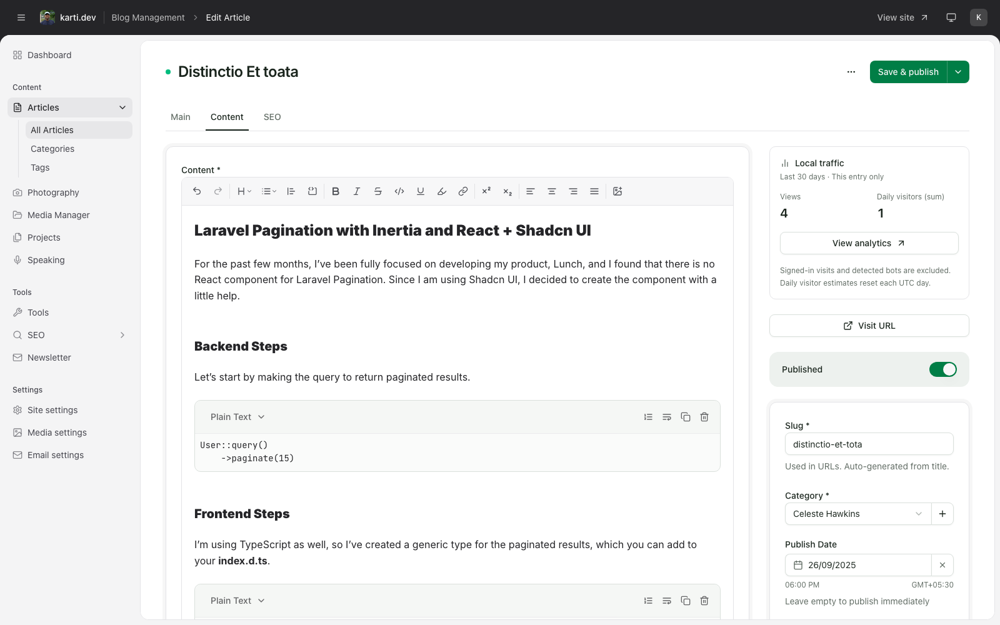
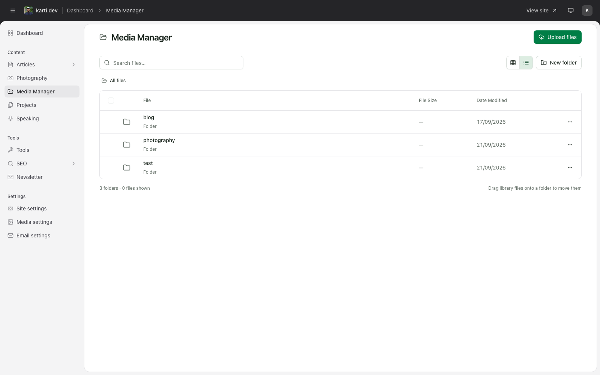

# Karti.dev

[](https://github.com/kkz6/karti.dev/actions/workflows/tests.yml)
[](https://github.com/kkz6/karti.dev/actions/workflows/lint.yml)
[](LICENSE)
[](https://github.com/sponsors/kkz6)

Karti.dev is a self-hosted publishing platform for a personal website. It brings articles, photography, projects, speaking, tools, newsletters, media, SEO, and first-party analytics into one focused administration experience.

The application is built as a modern Laravel monolith with React and Inertia.js. The production site is available at [karti.dev](https://karti.dev).

## Screenshots

### Public photography gallery



### Administration dashboard



### Article editor



### Media manager



## What is included

- **Publishing** — Manage articles, categories, tags, photography galleries, projects, speaking entries, and tools.
- **Media library** — Organize assets into folders, upload in batches, edit images, inspect metadata, and use responsive image variants on the public site.
- **Safe asset management** — Preserve references when files move and prevent deletion while media is still in use.
- **Analytics and SEO** — Review first-party page traffic, Google Analytics data, per-entry performance, and search previews.
- **Newsletter** — Collect confirmed subscriptions and monitor subscriber health from the dashboard.
- **Site administration** — Configure site identity, mail delivery, media processing, responsive image presets, and other operational settings.
- **Authentication** — Password login, email verification, passkeys, two-factor authentication, and recovery flows.
- **Reusable admin UI** — Shared tables, filtering, bulk actions, trash and restore workflows, unsaved-change protection, responsive layouts, and light/dark themes.

## Technology

- PHP 8.2+ and Laravel 12
- React 19, TypeScript, and Inertia.js 2
- Tailwind CSS 4 and Radix UI
- Vite for development and production builds
- Laravel Horizon and queued media processing
- SQLite, MySQL, or PostgreSQL
- Local or Amazon S3-compatible media storage
- Pest, PHPUnit, ESLint, Prettier, PHPStan, Rector, and Laravel Pint

## Requirements

- PHP 8.2 or newer with the extensions required by Laravel
- Composer 2
- Node.js 22 and npm
- A supported database
- A queue worker for media metadata and derivative generation
- GD or Imagick for image processing
- The PHP EXIF extension if camera metadata should be extracted

## Installation

```bash
git clone https://github.com/kkz6/karti.dev.git
cd karti.dev

composer install
npm install

cp .env.example .env
php artisan key:generate
php artisan migrate
php artisan storage:link
```

Configure the database and application URL in `.env`, then start the development services:

```bash
composer run dev
```

This starts Laravel, Vite, the queue listener, and Laravel Pail together. Open the URL printed by Laravel and sign in at `/login`.

### Creating the first user

The application does not expose public registration. Create an administrator from Tinker for a fresh installation:

```bash
php artisan tinker
```

```php
$user = new Modules\Auth\Models\User();
$user->name = 'Admin';
$user->email = 'admin@example.com';
$user->password = 'change-this-password';
$user->email_verified_at = now();
$user->save();
```

Laravel casts the password value before it is stored. Replace the example credentials and use a strong password.

## Configuration

### Queues

Several media operations run asynchronously. Keep a queue worker active outside the combined development command:

```bash
php artisan queue:work
```

For production, run the worker under a process supervisor or use Laravel Horizon.

### Media storage

Local storage works out of the box. To use S3, set `FILESYSTEM_DISK=s3` and configure the `AWS_*` values in `.env`. Image presets and the code-managed compression defaults are visible under **Admin → Media settings**.

### Email

Set the initial `MAIL_*` values in `.env`. After installation, delivery credentials and sender details can be managed under **Admin → Email settings**. Sensitive values are encrypted before storage.

### Analytics

First-party analytics are available without an external provider. Google Analytics reporting is optional and can be configured separately for the SEO reports.

## Development

```bash
# Run the PHP test suite
composer test

# Run frontend regression tests
node --experimental-strip-types --test modules/shared/tests/*.test.* modules/media/tests/*.test.*

# Type-check and build the frontend
npm run types
npm run build

# Check PHP formatting
composer test:lint
```

The codebase is organized into domain modules under `modules/`. Each module owns its backend code, routes, database files, frontend pages, and tests where applicable. Shared application components live in the `shared` and `table` modules.

## Contributing

Issues and pull requests are welcome. Before submitting a change:

1. Create a focused branch from `main`.
2. Add or update tests for behavioral changes.
3. Run the relevant PHP and frontend checks.
4. Open a pull request describing the problem and the approach taken.

Please do not include secrets, production data, or private media in issues or pull requests.

## Sponsorship

If Karti.dev or its components help your work, you can support ongoing development through [GitHub Sponsors](https://github.com/sponsors/kkz6).

## License

Karti.dev is open-source software released under the [MIT License](LICENSE).
